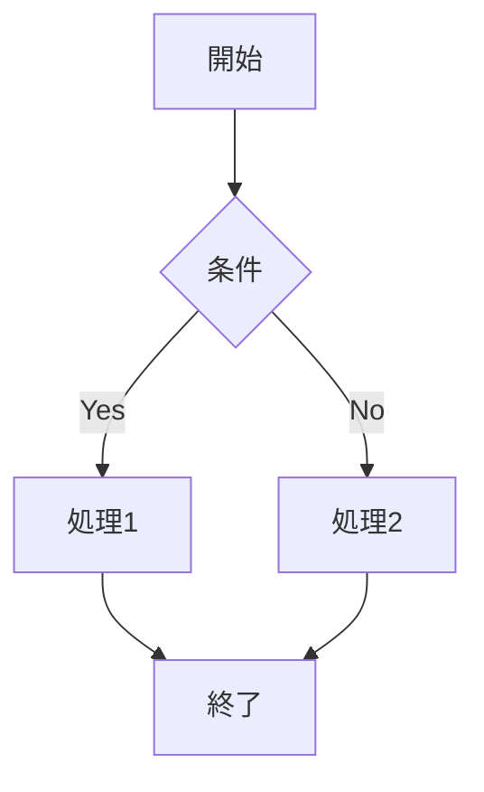

# 高度な機能ガイド

[ドキュメントインデックス](./index.md) > 高度な機能ガイド

## 概要

このガイドでは、数式、図、表、Mermaid、カスタムプリアンブルなど、MdTexプラグインの高度な機能について詳しく解説します。LaTeXの完全な機能を活用して、より高度なドキュメントを作成する方法を学びます。

---

## 数式の高度な使用法

MdTexはLaTeXの完全な数学機能をサポートしています。LuaLaTeXとunicode-mathパッケージにより、Unicodeの数学記号も使用できます。

### 基本的な数式記法

#### インライン数式

文中で数式を使用する場合は、`$...$` で囲みます：

```markdown
インライン数式: $E = mc^2$

フォーミュラ: $f(x) = x^2 + 2x + 1$

ギリシャ文字: $\alpha, \beta, \gamma, \Delta, \Omega$
```

#### ブロック数式

数式を独立したブロックとして表示する場合は、`$$...$$` で囲みます：

```markdown
$$
f(x) = \int_{-\infty}^{\infty} \hat{f}(\xi) e^{2\pi i \xi x} d\xi
$$
```

### 高度な数学記法

#### 積分と微積分

```markdown
$$
\int_{a}^{b} f(x) dx = F(b) - F(a)
$$

$$
\frac{d}{dx}\left(\int_{a}^{x} f(t) dt\right) = f(x)
$$
```

#### 線形代数

```markdown
$$
\mathbf{A}\mathbf{x} = \mathbf{b}
$$

$$
\mathbf{M} = \begin{bmatrix}
1 & 2 & 3 \\
4 & 5 & 6 \\
7 & 8 & 9
\end{bmatrix}
$$
```

#### 数式への参照

数式にラベルを付けて参照できます：

```markdown
$$
e^{i\pi} + 1 = 0
$$ {#eq:euler}

オイラーの等式（式[@eq:euler]）は、最も美しい数式の一つとされています。
```

### カスタムコマンドの定義

プリアンブルで独自のコマンドを定義できます：

```latex
\newcommand{\R}{\mathbb{R}}
\newcommand{\norm}[1]{\left\lVert#1\right\rVert}
\newcommand{\inner}[2]{\left\langle#1,#2\right\rangle}
```

使用例：

```markdown
$$
\mathbf{x} \in \R^n
$$

$$
\norm{\mathbf{x}} = \sqrt{\inner{\mathbf{x}}{\mathbf{x}}}
$$
```

---

## 図のキャプションと参照

### 基本的な画像挿入

```markdown

```

### 画像サイズの指定

```markdown
{width=80%}
{height=5cm}
{width=0.8\textwidth}
```

### キャプションと参照

pandoc-crossrefを使用する場合：

```markdown
{#fig:example}

図[@fig:example]は、システムのアーキテクチャを示しています。
```

---

## 表の高度な使用法

### 基本的な表

```markdown
| 列1 | 列2 | 列3 |
|-----|-----|-----|
| A   | B   | C   |
| D   | E   | F   |
```

### キャプション付きの表

```markdown
| 項目 | 値1 | 値2 |
|-----|-----|-----|
| A   | 10  | 20  |
| B   | 30  | 40  |

Table: サンプル表 {#tbl:sample}
```

---

## Mermaid図の使用

Mermaid記法で書かれた図をPNGに変換してPDFに埋め込みます。

### 有効化

設定画面で「Mermaid実験機能を有効」をオンにします。

### フローチャート

```markdown

```

---

## TikZによる描画

TikZはLaTeXの強力な描画ライブラリです。プリアンブルに以下を追加して使用します。

### プリアンブルの設定

```latex
\usepackage{tikz}
\usetikzlibrary{shapes, arrows, positioning}
```

### 基本的な図形

```latex
\begin{tikzpicture}
\draw[fill=blue] (0,0) circle (1cm);
\draw[fill=red] (2,0) rectangle (3,1);
\end{tikzpicture}
```

---

## カスタムプリアンブル

### 追加パッケージのインポート

```latex
\usepackage{enumitem}      % リストのカスタマイズ
\usepackage{siunitx}        % SI単位
\usepackage{float}         % 図表の配置
\usepackage{subcaption}    % サブキャプション
\usepackage{tcolorbox}     % カラーボックス
\usepackage{colortbl}      % 表の色
\usepackage{booktabs}      % 美しい表
```

### カスタムコマンド

```latex
\newcommand{\TODO}[1]{\textcolor{red}{[TODO: #1]}}
\newcommand{\keyword}[1]{\textbf{\textcolor{blue}{#1}}}
\newcommand{\highlight}[1]{\colorbox{yellow}{#1}}
```

---

## 関連トピック

- [Markdownガイド](./markdown-guide.md) - Markdown記法の詳細
- [設定リファレンス](./configuration.md) - 設定オプション
- [Beamerガイド](./beamer-guide.md) - プレゼンテーション作成
- [トラブルシューティング](./troubleshooting.md) - 問題解決

## 次のトピック

- [Markdownガイド](./markdown-guide.md)
