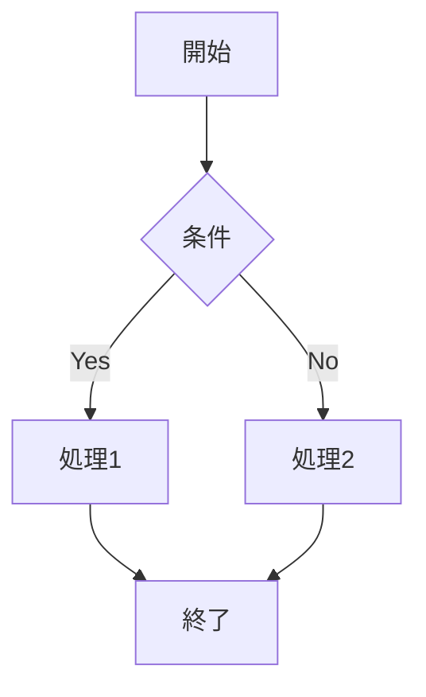

# 機能一覧

MdTexプラグインの各機能を詳しく解説します。

---

## 目次

- [PDF変換](#pdf変換)
- [LaTeXソース出力](#latexソース出力)
- [DOCX変換](#docx変換)
- [LaTeXコマンドパレット](#latexコマンドパレット)
- [Lint/自動修正](#lint自動修正)
- [クロスリファレンス](#クロスリファレンス)
- [トランスクルージョン](#トランスクルージョン)
- [Mermaid図の変換](#mermaid図の変換)
- [WikiLinkの処理](#wikilinkの処理)
- [ステータスバー](#ステータスバー)

---

## PDF変換

### 概要

Markdownファイルを高品質なPDFに変換します。PandocとLuaLaTeXを使用し、特に日本語ドキュメントの処理に最適化されています。

### 特徴

- **多言語対応**: 日本語、英語、その他多言語を適切に処理
- **フォント制御**: Notoフォントファミリーを使用した美しい組版
- **数式レンダリング**: LaTeXの数学記号を高品質に出力
- **コードブロック**: シンタックスハイライト付き
- **図表**: 画像、表の自動配置とキャプション

### 使用方法

1. 変換したいMarkdownファイルを開く
2. 以下のいずれかを実行：
   - リボンアイコンをクリック
   - コマンドパレット → 「PDFへ変換」

### 設定オプション

- **LaTeXエンジン**: `lualatex`（推奨）、`xelatex`、`pdflatex`
- **ドキュメントクラス**: `ltjarticle`、`article`、`book`、`report`など
- **フォントサイズ**: `10pt`〜`14pt`
- **余白**: 自由に設定可能

---

## LaTeXソース出力

### 概要

PDFではなく、LaTeXソースファイル（.tex）を生成します。手動での調整や、他のLaTeXワークフローとの統合に使用します。

### 使用例

- 自動生成されたLaTeXを手動で調整したい場合
- 学術誌のテンプレートに組み込みたい場合
- バージョン管理システムでLaTeXソースを管理したい場合

### 使用方法

1. 設定画面で「出力フォーマット」を`latex`に変更
2. リボンアイコンまたはコマンドパレットで変換実行

### 生成されるファイル

- `.tex` - LaTeXソースファイル
- `.preamble.tex` - ヘッダー設定（別ファイルとして保存）

---

## DOCX変換

### 概要

Microsoft Word形式（.docx）に変換します。Luaフィルタを使用して、画像やテーブルのスタイルを調整します。

### 注意事項

- **実験的機能**: 一部のLaTeXコマンドは変換されません
- **フォント**: システムにインストールされたフォントが使用されます
- **数式**: 数式はWordの数式エディタ形式に変換されます

### 使用方法

1. 設定画面で「出力フォーマット」を`docx`に変更
2. 「高度なLaTeXコマンドを有効」をオンに
3. 必要に応じて「Luaフィルタのパス」を指定
4. Pandoc追加引数に`--reference-doc=reference.docx`を指定（テンプレート使用時）

### 参考テンプレートの作成

```bash
pandoc --print-default-data-file reference.docx > reference.docx
```

生成したファイルをWordで開いてスタイルを調整し、プラグイン設定のリソース検索ディレクトリに配置します。

---

## LaTeXコマンドパレット

### 概要

よく使うLaTeXコマンドを検索・挿入する機能です。インライン補完やゴーストテキストも提供します。

### 詳細

詳細は[LaTeXコマンドパレット](./latex-palette.md)を参照してください。

### クイックスタート

1. コマンドパレット → 「LaTeXコマンドを検索して挿入」
2. 検索ボックスにキーワードを入力（例: `newpage`）
3. 目的のコマンドを選択してEnter

---

## Lint/自動修正

### 概要

markdownlint-cli2を統合し、Markdownの品質チェックと自動修正を行います。

### 機能

1. **Lint実行**: 問題をチェックして通知
2. **自動修正**: 自動的に修正可能な問題を解決

### 有効化手順

1. markdownlint-cli2をインストール:
   ```bash
   npm install -g markdownlint-cli2
   ```

2. 設定画面で「Markdownlint --fixを実行」をオン

3. （オプション）markdownlint-cli2のパスを指定

### 実行タイミング

- **変換前**: PDF/DOCX/LaTeX変換前に自動実行
- **手動**: コマンドパレット → 「開いているノートにmarkdownlint --fixを実行」

### 修正される主な問題

- リストのインデント統一
- 不要な空白の削除
- 見出しのフォーマット
- コードブロックの言語指定

---

## クロスリファレンス

### 概要

pandoc-crossrefを使用して、図・表・数式・コードブロックに自動的に番号を付け、文中から参照できるようにします。

### 有効化

1. pandoc-crossrefをインストール:
   ```bash
   pip install pandoc-crossref
   ```

2. 設定画面で「Pandoc Crossrefを使う」をオン（デフォルトでオン）

### 使用方法

#### 図への参照

```markdown
{#fig:myimage}

図[@fig:myimage]は重要な概念を示しています。
```

#### 表への参照

```markdown
| 列1 | 列2 |
|-----|-----|
| A   | B   |

Table: 表のキャプション {#tbl:mytable}

表[@tbl:mytable]に結果を示す。
```

#### 数式への参照

```markdown
$$
E = mc^2
$$ {#eq:emc2}

式[@eq:emc2]は相対性理論の基本式である。
```

#### コードブロックへの参照

```markdown
```python
print("Hello")
``` {#lst:hello}

リスト[@lst:hello]は簡単な例である。
```

### ラベルのカスタマイズ

設定画面の「ラベルと言語設定」で、以下を変更できます：

- **図**: Figure / Fig.
- **表**: Table / Table
- **リスティング**: Listing / Listing
- **数式**: Equation / Eq.

---

## トランスクルージョン

### 概要

Obsidianの`![[filename]]`構文を使用して、他のファイルの内容を現在のドキュメントに埋め込みます。

### 使用方法

```markdown
# メインドキュメント

以下に別ファイルの内容を埋め込みます:

![[chapter1]]

![[chapter2]]
```

### 再帰的展開

入れ子になったトランスクルージョンも展開されます：

```
main.md
  └─ ![[chapter1]]
       └─ ![[section1]]
            └─ ![[subsection1]]
```

### 制限事項

- 循環参照（AがBを参照し、BがAを参照）は検出されますが、展開が停止します
- 多階層の展開は処理時間が増加する場合があります

---

## Mermaid図の変換

### 概要

Mermaid記法で書かれた図をPNG画像に変換し、PDFに埋め込みます。

### 注意事項

- **実験的機能**: 処理に時間がかかる場合があります
- **ObsidianのMermaidプラグイン**: 有効になっている必要があります
- **ブラウザレンダリング**: DOMを使用して描画します

### 有効化

設定画面で「Mermaid実験機能を有効」をオンにします。

### 使用方法

```markdown

```

変換時に自動的にPNGに変換され、PDFに埋め込まれます。

### トラブルシューティング

- 変換に失敗する場合は、Mermaid記法が正しいか確認
- 複雑な図は分割して記述することを検討

---

## WikiLinkの処理

### 概要

ObsidianのWikiLink（`[[filename]]`や`[[filename|表示名]]`）を適切に処理します。

### 処理内容

1. **有効なリンク**: 対象ファイルが存在する場合、リンクテキストに変換
2. **無効なリンク**: 対象ファイルが存在しない場合、そのまま表示
3. **WikiLinkの外し**: `[[Note Title]]` → `Note Title`

### 使用例

```markdown
# 変換前
詳細は[[プロジェクト計画|計画書]]を参照してください。

# 変換後（PDF）
詳細は計画書を参照してください。
```

### 画像のWikiLink

画像ファイルへのWikiLinkも処理されます：

```markdown
![[image.png]]
```

---

## ステータスバー

### 概要

Obsidianのステータスバーに変換の進行状況を表示します。

### 表示内容

- **待機中**: `MdTex: 待機中`
- **変換中**: `MdTex: PDFへ変換中`
- **完了**: `MdTex: 完了 (PDF, 1234 ms)`
- **エラー**: `MdTex: PDFでエラー`

### 活用方法

- 変換処理の進行状況を確認
- 変換にかかった時間を把握
- エラー発生を即座に認知

---

## 高度な機能

### Draftモード

ドラフトモードでは、画像を低品質で埋め込み、コンパイル時間を短縮できます。

**使用方法**:
1. Pandoc追加引数に`--draft`を追加
2. または、フロントマターに以下を追加:
   ```yaml
   ---
   mdtex:
     draft: true
   ---
   ```

### カスタムLaTeXプリアンブル

デフォルトのプリアンブルをカスタマイズして、追加のパッケージやマクロを定義できます。

詳細は[設定リファレンス](./configuration.md)の「LaTeXプリアンブル」セクションを参照。

### Pandoc追加引数

Pandocの追加引数を使用して、細かい制御が可能です：

- `--toc`: 目次を生成
- `--number-sections`: 見出しに番号を付ける
- `--highlight-style=kate`: コードハイライトスタイル
- `--template=custom.tex`: カスタムテンプレート使用

---

## 関連ドキュメント

- [クイックスタート](./quickstart.md)
- [設定リファレンス](./configuration.md)
- [プロファイル管理](./profiles.md)
- [LaTeXコマンドパレット](./latex-palette.md)
- [トラブルシューティング](./troubleshooting.md)
