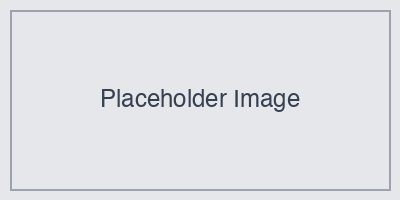

# チュートリアル

[ドキュメントインデックス](./index.md) > チュートリアル

## 概要

このチュートリアルでは、MdTeX プラグインの実践的な使い方を、基本操作から論文、レポート、プレゼンテーションといった具体的な用途まで説明する。

---

## ステップ1: 基本的なMarkdownファイルの変換

まずは、最も基本的なMarkdownファイルを作成してPDFに変換する。

### サンプルファイルの作成

新しいMarkdownファイルを作成し、以下の内容を入力する：

```markdown
---
title: はじめてのMdTeX
author: 山田太郎
date: 2025-01-31
---

# はじめてのMdTeX

MdTeXプラグインを使用すると、Obsidianで作成したMarkdownファイルをPDFに変換できる。

## 特徴

- 多言語対応
- 高品質なPDF出力
- シンプルな操作

## 使い方

1. Markdownファイルを開く
2. リボンアイコンをクリック
3. PDFが生成される

## 数式の例

インライン数式: $E = mc^2$

ブロック数式:

$$
f(x) = \int_{-\infty}^{\infty} \hat{f}(\xi) e^{2\pi i \xi x} d\xi
$$
```

### 変換の実行

1. ファイルを保存
2. 以下のいずれかの方法で変換を実行：
   - リボンアイコン（サイドバーのファイルアイコン）をクリック
   - コマンドパレット（Cmd/Ctrl+P）を開いて「PDFへ変換」と入力

3. ステータスバーに「MdTeX: PDFへ変換中」と表示され、完了すると「MdTeX: 完了」となる
4. 出力ディレクトリ（デフォルトはVaultルート）にPDFファイルが生成される

### 結果の確認

生成されたPDFを開いて以下を確認する：
- タイトルと著者名が正しく表示されている
- 日本語が文字化けせずに表示されている
- 数式が適切にレンダリングされている
- 箇条書きのインデントが正しい

---

## ステップ2: 論文風ドキュメントの作成

次に、学術論文のような構造を持つドキュメントを作成する。章立て、引用、図表の参照など、論文でよく使う要素を含める。

### 論文構成の例

以下のような構造のMarkdownファイルを作成する：

```markdown
---
title: ディープラーニングによる画像認識の研究
author: 山田太郎
date: 2025-01-31
institute: 東京大学
---

# はじめに

近年、ディープラーニング技術の発展により、画像認識の精度が劇的に向上している[@fig:accuracy_trend]。

本研究では、CNN（畳み込みニューラルネットワーク）を用いた新しい画像認識手法を提案する。

## 関連研究

従来の画像認識手法には以下のようなものがある：

- 手動特徴抽出 + SVM
- Bag of Features
- 初期のCNNモデル

これらの手法は、従来は一定の成果を上げていたが、大規模データセットでの精度には限界があった[@tbl:comparison]。

## 提案手法

### アーキテクチャ

提案手法のアーキテクチャを図[@fig:proposed_method]に示す。

{#fig:proposed_method}

### 数学的定式化

畳み込み層の出力は以下の式で表される：

$$
y_{i,j} = \sum_{m} \sum_{n} x_{i+m, j+n} \cdot w_{m,n} + b
$$ {#eq:convolution}

式[@eq:convolution]において、$w$は畳み込みカーネル、$b$はバイアス項である。

## 実験

### データセット

CIFAR-10データセットを使用した。このデータセットは以下の特徴を持つ：

- 画像サイズ: 32x32 ピクセル
- クラス数: 10
- トレーニングデータ: 50,000枚
- テストデータ: 10,000枚

### 結果

各手法の精度比較を表[@tbl:results]に示す。

| 手法 | 精度(%) |
|-----|--------|
| SVM + 手動特徴 | 72.3 |
| Bag of Features | 78.5 |
| AlexNet | 85.2 |
| VGG-16 | 89.5 |
| 提案手法 | 92.1 |

Table: 各手法の精度比較 {#tbl:results}

提案手法が、従来手法と比較して最も高い精度を達成した[@tbl:results]。

## 考察

実験結果から、以下の知見が得られた：

1. 残差接続の導入により、深いネットワークでの学習が安定化した
2. データ拡張の効果により、汎化性能が向上した
3. 注意機構の導入により、重要な領域への適切な重み付けが可能になった

## 結論

本稿では、新しいCNNアーキテクチャを提案し、その有効性を実証した。今後の課題としては、計算コストの削減と、他のタスクへの応用が挙げられる。

## 参考文献

1. LeCun, Y., et al. (1998). Gradient-based learning applied to document recognition.
2. Krizhevsky, A., et al. (2012). ImageNet Classification with Deep Convolutional Neural Networks.
3. He, K., et al. (2016). Deep Residual Learning for Image Recognition.
```

### 論文用プロファイルの設定

論文を作成する場合、以下のような設定を推奨する：

1. 設定画面で「新しいプロファイルを作成」をクリック
2. プロファイル名: `論文用` を入力
3. 以下の設定を変更：

| 設定項目 | 推奨値 |
|---------|--------|
| ドキュメントクラス | `ltjarticle` |
| フォントサイズ | `11pt` |
| マージン | `25mm` |
| Pandoc追加引数 | `--toc --number-sections` |

### 変換と確認

作成した論文をPDFに変換して以下を確認する：
- 目次が正しく生成されている
- 章番号が付与されている
- 図表への参照が正しく動作している
- 数式番号が正しく表示されている

---

## ステップ3: テクニカルレポートの作成

技術的なドキュメントには、コードブロック、図表、詳細な説明などが必要である。ここでは、APIドキュメントのようなテクニカルレポートを作成する。

### テクニカルレポートの例

```markdown
---
title: REST API仕様書
author: 開発チーム
date: 2025-01-31
version: 1.0.0
---

# REST API仕様書

本ドキュメントは、弊社製品のREST APIの仕様を説明する。本APIはJSON形式でのデータ入出力をサポートし、認証にはOAuth 2.0を使用する。

## ベースURL

```
https://api.example.com/v1
```

## 認証

すべてのリクエストにはAuthorizationヘッダーが必要である：

```http
Authorization: Bearer <access_token>
```

### トークンの取得

```bash
curl -X POST https://api.example.com/v1/oauth/token \
  -H "Content-Type: application/json" \
  -d '{
    "client_id": "your_client_id",
    "client_secret": "your_client_secret",
    "grant_type": "client_credentials"
  }'
```

レスポンス:

```json
{
  "access_token": "abc123def456",
  "token_type": "Bearer",
  "expires_in": 3600
}
```

## エンドポイント一覧

| メソッド | パス | 説明 |
|---------|------|------|
| GET | /users | ユーザー一覧取得 |
| GET | /users/{id} | ユーザー詳細取得 |
| POST | /users | ユーザー作成 |
| PUT | /users/{id} | ユーザー更新 |
| DELETE | /users/{id} | ユーザー削除 |

Table: APIエンドポイント一覧 {#tbl:endpoints}

## ユーザーAPIの詳細

### ユーザー一覧取得

**リクエスト:**

```http
GET /users?page=1&limit=20
```

**クエリパラメータ:**

| パラメータ | 型 | 必須 | 説明 |
|----------|----|----|------|
| page | integer | いいえ | ページ番号（デフォルト: 1） |
| limit | integer | いいえ | 1ページあたりの件数（デフォルト: 20） |

**レスポンス:**

```json
{
  "data": [
    {
      "id": 1,
      "name": "山田太郎",
      "email": "yamada@example.com",
      "created_at": "2025-01-31T00:00:00Z"
    }
  ],
  "pagination": {
    "total": 100,
    "page": 1,
    "limit": 20,
    "pages": 5
  }
}
```

### ユーザー作成

**リクエスト:**

```http
POST /users
Content-Type: application/json

{
  "name": "鈴木花子",
  "email": "suzuki@example.com",
  "password": "secure_password"
}
```

**ステータスコード:**

| コード | 説明 |
|-------|------|
| 201 | 作成成功 |
| 400 | リクエスト不正 |
| 409 | メールアドレス重複 |

## エラーレスポンス

エラーが発生した場合、以下の形式でレスポンスが返される：

```json
{
  "error": {
    "code": "INVALID_REQUEST",
    "message": "リクエストパラメータが無効である",
    "details": [
      {
        "field": "email",
        "message": "メールアドレスの形式が正しくない"
      }
    ]
  }
}
```

## レート制限

APIへのアクセスには以下のレート制限が適用される：

| プラン | リクエスト数/時間 |
|-------|------------------|
| Free | 1,000/時間 |
| Basic | 10,000/時間 |
| Pro | 100,000/時間 |

Table: レート制限 {#tbl:rate_limits}

レート制限を超えた場合、`429 Too Many Requests`が返される。
```

---

## ステップ4: プレゼンテーションスライドの作成

Beamerを使用してプレゼンテーションスライドを作成する。詳細は[Beamerガイド](./beamer-guide.md)を参照すること。

### スライド用プロファイルの設定

1. 「新しいプロファイルを作成」をクリック
2. プロファイル名: `スライド用` を入力
3. 以下の設定を変更：

| 設定項目 | 推奨値 |
|---------|--------|
| ドキュメントクラス | `beamer` |
| フォントサイズ | `10pt` |
| マージンを指定 | 無効 |
| Pandoc Crossref | 無効 |

---

## ステップ5: プロファイルの活用

異なる用途で異なる設定を使い分けることで、作業効率を向上させることができる。詳細は[プロファイル管理ガイド](./profiles.md)を参照すること。

### プロファイルの作成例

#### 論文用プロファイル

| 設定項目 | 値 |
|---------|-----|
| 出力フォーマット | `pdf` |
| ドキュメントクラス | `ltjarticle` |
| フォントサイズ | `11pt` |
| マージン | `25mm` |
| Pandoc追加引数 | `--toc --number-sections` |

#### スライド用プロファイル

| 設定項目 | 値 |
|---------|-----|
| 出力フォーマット | `pdf` |
| ドキュメントクラス | `beamer` |
| フォントサイズ | `10pt` |
| マージンを指定 | 無効 |
| Pandoc Crossref | 無効 |

---

## ステップ6: 複数ファイルの統合

大きなドキュメントは、複数のファイルに分割して管理すると便利である。トランスクルージョン機能を使用して、複数のファイルを1つのPDFに統合できる。

### ファイル構成の例

```
my-book/
├── index.md          (メインファイル)
├── chapter1.md
├── chapter2/
│   ├── section1.md
│   └── section2.md
└── appendix.md
```

### メインファイル (index.md)

```markdown
---
title: 完全ガイドプック
author: 山田太郎
date: 2025-01-31
---

# はじめに

本書は複数の章で構成される。

![[chapter1]]

![[chapter2/section1]]

![[chapter2/section2]]

![[appendix]]
```

---

## よくある質問

### Q: 既存のMarkdownファイルを変換できるか？

A: はい、既存のMarkdownファイルをそのまま変換できる。ただし、以下の点に注意する：

- Obsidian固有の記法（`[[WikiLink]]`など）は適切に変換される
- コールアウトやタグはプレーンテキストとして扱われる
- 複雑なテーブルは正しく表示されない場合がある

### Q: 画像を含むドキュメントを変換するには？

A: 画像ファイルは以下の方法で含めることができる：

1. **標準のMarkdown記法**:
   ```markdown
   
   ```

2. **WikiLink記法**:
   ```markdown
   ![[image.png]]
   ```

3. **サイズ指定**:
   ```markdown
   {width=80%}
   ```

---

## 次のステップ

基本操作が分かったら、次のドキュメントで詳しい機能を確認する。

- [Markdownガイド](./markdown-guide.md) - Markdown記法の詳細
- [高度な機能ガイド](./advanced.md) - 数式、図表、Mermaidなど
- [設定リファレンス](./configuration.md) - すべての設定オプション
- [Beamerガイド](./beamer-guide.md) - プレゼンテーションの詳細
- [機能一覧](./features.md) - 各機能の詳しい説明

---

## 関連トピック

- [クイックスタート](./quickstart.md)
- [高度な機能ガイド](./advanced.md)
- [設定リファレンス](./configuration.md)
- [プロファイル管理](./profiles.md)

## 次のトピック

- [高度な機能ガイド](./advanced.md)
