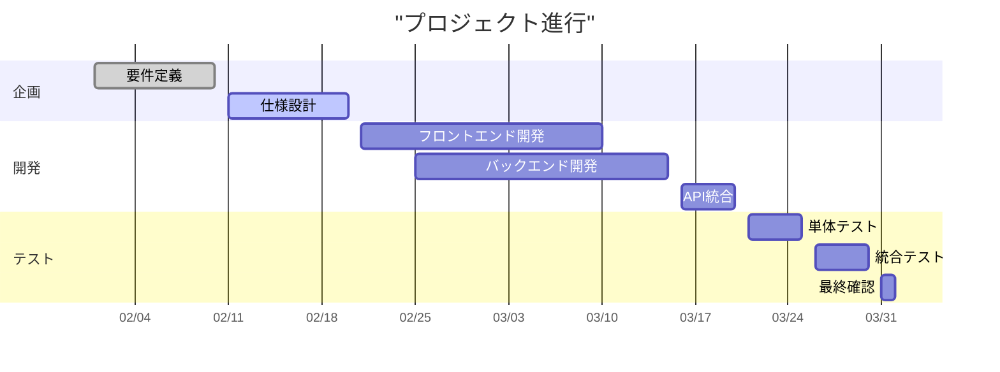
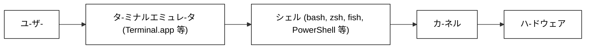

\clearpage


{#fig:mermaid}[mermaid]



{#fig:system-arch}[システム構成図]
 


![[Pasted image 20251203125441.png]]{#fig:kitty}[terminal]


![[Pasted image 20251202224513.png]]{#fig:hogehoge width=120mm}[適当な画像]


\clearpage

相互参照

- [@fig:mermaid]

- [@fig:system-arch]

- [@fig:kitty]

- [@fig:hogehoge]

このように表示できます。


\clearpage

# MdTex Plugin 機能テスト

このドキュメントは、MdTex Plugin の新機能およびリファクタリング後の動作確認用ファイルです。

## 1. コールアウト

> ただの引用

> [!memo]
> 
> 今回のアップデートで引用（Blockquote）のデザインが `tcolorbox` ベースに変更されました。
> 背景色や左側のラインが正しく表示されているか確認してください。

## 2. 埋め込みリンク (Transclusion) の展開

以下に、外部ファイル `mdtex_test_sub.md` の内容が展開されます。


![[mdtex_test_sub]]


\clearpage

### 埋め込みの引用

>![[mdtex_test_sub]]


## 3. 数式と相互参照 (Equations)

オイラーの等式を以下に示します。

$$
e^{i\pi} + 1 = 0
$$
{#eq:euler}

上記の数式は [@eq:euler]です。
数式番号が自動的に付与され、本文中の参照リンクが機能していることを確認してください。


\clearpage

## 4. コードブロックとListing (Code Blocks)

Pythonコードのハイライトと、キャプション・枠線の表示を確認します。

```{#lst:python_demo caption="Hello World関数"}
def hello_world():
    # 日本語コメントの確認
    print("Hello, MdTex!")

if __name__ == "__main__":
    hello_world()
    

```

シンタックスハイライト時のバグを修正しました。

```python{#lst:python_demo_hoge caption="Hello World関数"}
def hello_world():
    # 日本語コメントの確認
    print("Hello, MdTex!")

if __name__ == "__main__":
    hello_world()
    

```


通常のコードブロックも表示可能です。

```
def hello_world():
    # 日本語コメントの確認
    print("Hello, MdTex!")

if __name__ == "__main__":
    hello_world()
    

```


相互参照 

- [@lst:python_demo]  

- [@lst:python_demo_hoge]

## 5. 表

| 11  | 12  |
| --- | --- |
| 12  | 13  |
: table {#tbl:table}


相互参照　

- [@tbl:table]


